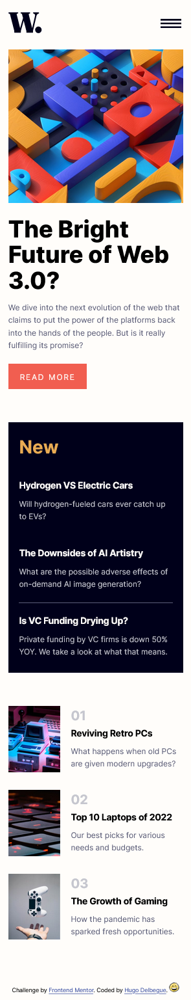

# Frontend Mentor - News homepage solution

This is a solution to the [News homepage challenge on Frontend Mentor](https://www.frontendmentor.io/challenges/news-homepage-H6SWTa1MFl).

## Table of contents

- [Overview](#overview)
  - [The challenge](#the-challenge)
  - [Screenshot](#screenshot)
  - [Links](#links)
- [My process](#my-process)
  - [Built with](#built-with)
  - [What I learned](#what-i-learned)
  - [Continued development](#continued-development)
  - [Useful resources](#useful-resources)
- [Author](#author)
- [Acknowledgments](#acknowledgments)

## Overview

### The challenge

Users should be able to:

- View the optimal layout for the interface depending on their device's screen size
- See hover and focus states for all interactive elements on the page

### Screenshot

- Desktop
  

- Mobile
  

### Links

- Solution URL: [Add solution URL here](https://your-solution-url.com)
- Live Site URL: [Add live site URL here](https://your-live-site-url.com)

## My process

### Built with

- Semantic HTML5 markup
- CSS custom properties
- Flexbox
- CSS media queries
- Sass imports
- Sass variables and mixins
- Events Javascript
- Mobile-first workflow
- [Google Fonts](https://fonts.google.com/) - Fonts imports for typography
- [CSS Tools](https://meyerweb.com/eric/tools/css/reset/) - Reset CSS
- [Sass](https://sass-lang.com/) - CSS language preprocessor

### What I learned

Use this section to recap over some of your major learnings while working through this project. Writing these out and providing code samples of areas you want to highlight is a great way to reinforce your own knowledge.

To see how you can add code snippets, see below:

```html
<h1>Some HTML code I'm proud of</h1>
```

```css
.proud-of-this-css {
  color: papayawhip;
}
```

```js
const proudOfThisFunc = () => {
  console.log("🎉");
};
```

If you want more help with writing markdown, we'd recommend checking out [The Markdown Guide](https://www.markdownguide.org/) to learn more.

**Note: Delete this note and the content within this section and replace with your own learnings.**

### Continued development

Use this section to outline areas that you want to continue focusing on in future projects. These could be concepts you're still not completely comfortable with or techniques you found useful that you want to refine and perfect.

**Note: Delete this note and the content within this section and replace with your own plans for continued development.**

### Useful resources

- [A Complete Guide to Flexbox](https://css-tricks.com/snippets/css/a-guide-to-flexbox/) - Complete guide to easy learning Flexbox.
- [Developer mozilla](https://developer.mozilla.org/fr/) - Resources for Html CSS and Javascript. Here you will find all the necessary documentation for the methods to be used.

## Author

- Website - [PriamlProd](https://primalprod.fr/)
- Frontend Mentor - [@hugodelbegue](https://www.frontendmentor.io/profile/HUGODELBEGUE)
- GitHub - [@hugodelbegue](https://github.com/HUGODELBEGUE)

## Acknowledgments

Youtube tutorials:

- Graphikart [https://grafikart.fr/](https://grafikart.fr/)
- From Scratch [From Scratch - Le développement Web de zéro](https://www.youtube.com/@FromScratchDeveloppementWeb/featured)
- Bertrand [La Tech avec Bertrand](https://www.youtube.com/@TechAvecBertrand)

Online training:

- Codecademy [https://www.codecademy.com/](https://www.codecademy.com/)
